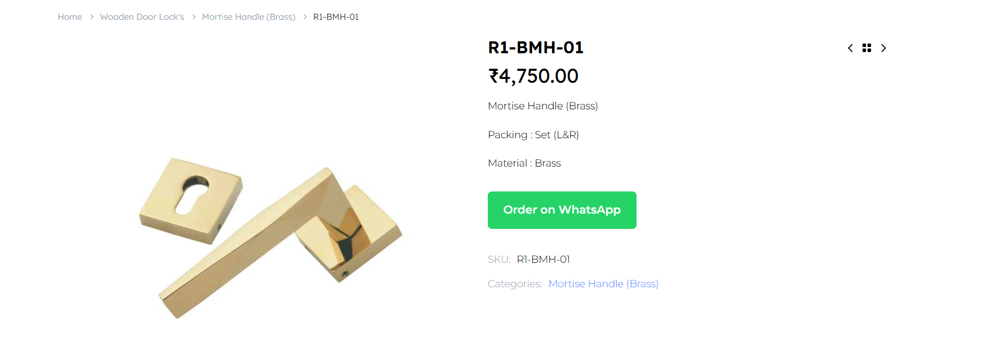

# 🟢 Direct Order on WhatsApp for WooCommerce

A powerful WooCommerce plugin that allows customers to place orders instantly via WhatsApp with customizable settings and dynamic control.

---

## 📌 Overview

This plugin adds an **"Order on WhatsApp"** button to your WooCommerce store, allowing customers to directly contact you with product details.

Now comes with a **settings panel**, so you can control where the button appears and set your own WhatsApp number.

---

## ✨ Features

* ✅ Add WhatsApp button to:

  * Product Page
  * Shop Page
  * Cart Page

* ✅ **Admin Settings Panel**

  * Set dynamic WhatsApp number
  * Enable/disable button on different pages

* ✅ Auto-generated WhatsApp message with:

  * Product Name
  * Price
  * SKU
  * Quantity
  * Product Link

* ✅ No checkout required

* ✅ Direct customer-to-admin communication

* ✅ Reduces fake orders & cart abandonment

* ✅ Lightweight & fast

---

## ⚙️ Settings Options

After activating the plugin:

* Go to **WordPress Dashboard → Settings → WhatsApp Order**
* Configure:

  * 📱 WhatsApp Number
  * ☑ Show on Product Page
  * ☑ Show on Shop Page
  * ☑ Show on Cart Page

---

## ⚙️ How It Works

1. Customer visits your store
2. Clicks on **"Order on WhatsApp"**
3. WhatsApp opens with pre-filled product details
4. Customer sends message and confirms order

---

## 📸 Screenshot

---

## 📦 Installation

1. Download the plugin ZIP
2. Go to **WordPress Dashboard → Plugins → Add New**
3. Click **Upload Plugin**
4. Upload & Activate

---

## 🛠 Tech Stack

* PHP
* WordPress Hooks & Settings API
* WooCommerce
* JavaScript

---

## 👨‍💻 Author

**Smit Jadav**

---

## 🚀 Future Improvements

* Custom message template
* Multiple WhatsApp agents
* Order history/log system
* Payment integration

---

## ⭐ Support

If you like this plugin, give it a ⭐ on GitHub!
